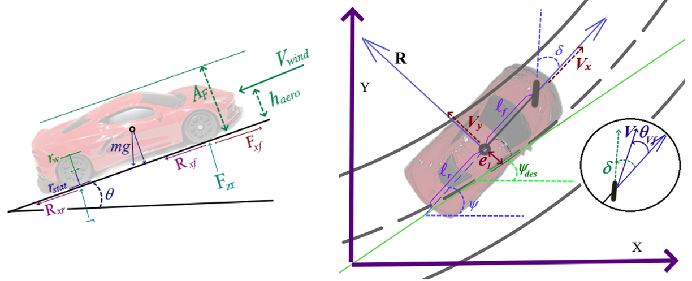
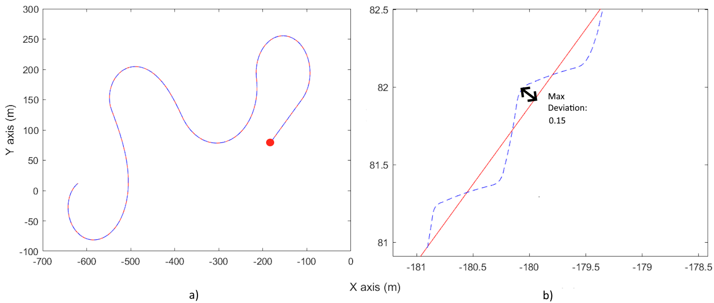
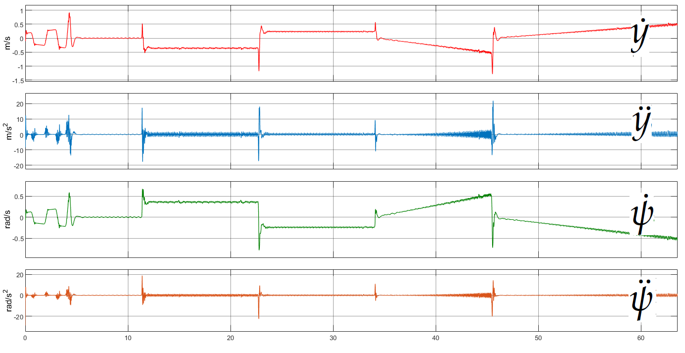
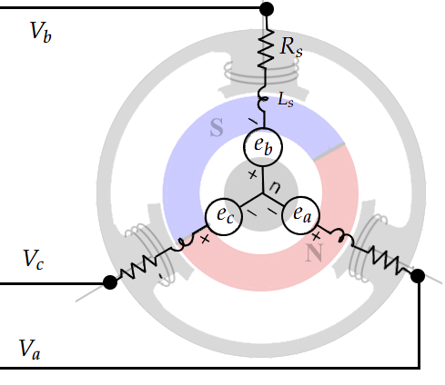
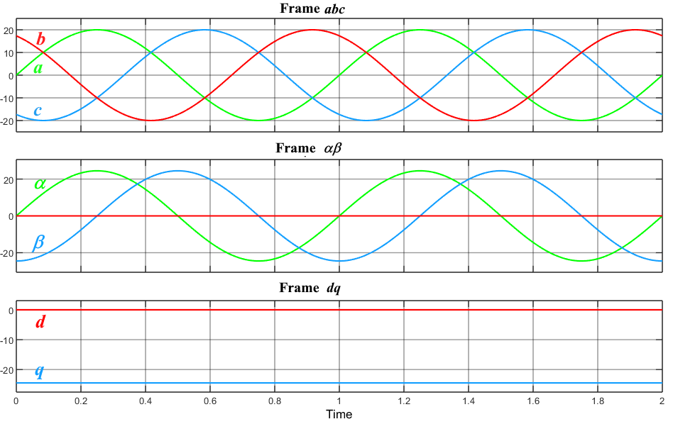

Project Description. You can find the [📄  Documentation (PDF)](docs/manual.pdf) (In development) here.

This project is a MATLAB/Simulink model that simulates the longitudinal and lateral dynamics of a vehicle, incorporating electric motors as the main actuators. The goal is to provide a flexible and modular environment for studying and developing controllers for electric and autonomous vehicles.

 

The model offers the following features:

Customizable Route Creation: Users can define specific trajectories for the vehicle to follow during the simulation.

Testing of Custom Controllers:

Steering (Lateral Control): Users can implement and test steering control algorithms, such as PID, MPC, or AI-based techniques.
Power (Longitudinal Control): It is possible to integrate and evaluate controllers for vehicle acceleration and braking, optimized for electric motors.

you can define your trajectory and see how your vehicle follows your road.
 

 you can see the internal performance of the lateral and longitudinal dynamics.
  

Electric Actuators: The model includes electric motors as key actuators, making it ideal for simulations focused on electric vehicles and the transition to clean technologies.

 

you can see the currrents and voltages of the electric motors as example, the abc - dq conversion reference frame.

Customizable Environment: Thanks to Simulink's modularity, the model can be easily adapted to different vehicle configurations and simulation conditions.

Applications
Evaluation of control strategies for electric and autonomous vehicles.
Simulations of urban and highway scenarios to validate controllers.
Academic development in vehicle dynamics and control.

you can visit my personal homepage for more info at [Luis Arturo Torres](https://l-arturo-torres-romero.github.io)
